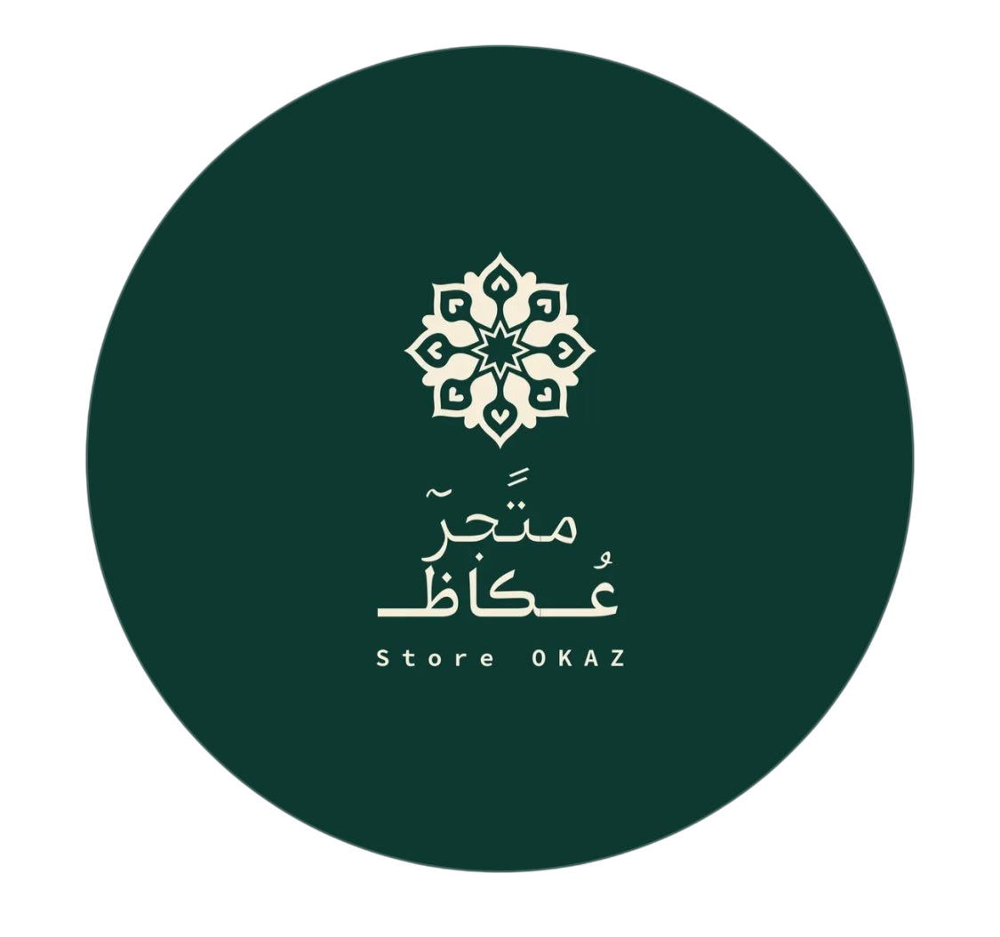

# 🌟 Store Okaz | ستور عكاظ



## 🇧🇭 Premium Arabic E-Commerce Landing Page

موقع فاخر لمتجر عكاظ - متخصص في بيع البخور والعطور الشرقية والإكسسوارات الراقية في مملكة البحرين

---

## ✨ المميزات

### 🎨 تصميم فاخر
- تصميم يشبه Apple و Louis Vuitton و Dior
- نظام ألوان احترافي (أخضر داكن + كريمي + ذهبي)
- مساحات بيضاء واسعة وتايبوغرافي مثالي
- تأثيرات Glassmorphism و Gradient فاخرة

### ⚡ أنيميشنات متقدمة
- ✅ شاشة تحميل احترافية
- ✅ Parallax effects
- ✅ جزيئات متحركة (Particles)
- ✅ Floating animations
- ✅ Fade In/Up animations
- ✅ Magnetic hover effects
- ✅ Ripple effect على الأزرار
- ✅ Smooth scroll

### 🛠️ تقنيات مستخدمة
- **HTML5** - Semantic markup
- **CSS3** - Custom properties, Grid, Flexbox
- **Vanilla JavaScript** - لا frameworks
- **RTL Support** - دعم كامل للعربية
- **Responsive Design** - متجاوب مع جميع الشاشات

### 📱 الأقسام
1. **Navigation** - قائمة تنقل ثابتة مع glass effect
2. **Hero Section** - قسم رئيسي فاخر مع أنيميشنات
3. **Categories** - تصنيفات المنتجات (بخور، عطور، إكسسوارات)
4. **Products** - عرض المنتجات الأكثر مبيعاً
5. **Features** - مميزات المتجر
6. **About** - نبذة عن ستور عكاظ
7. **Reviews** - آراء العملاء مع slider
8. **Delivery Banner** - قسم التوصيل
9. **TikTok Section** - دعوة للمتابعة
10. **Contact** - نموذج التواصل
11. **Footer** - تذييل احترافي

---

## 🚀 التشغيل

### طريقة سهلة:
فقط افتح ملف `index.html` في المتصفح!

### أو استخدم Live Server:
```bash
# إذا كان لديك VS Code
# اضغط زر الفأرة الأيمن على index.html
# واختر "Open with Live Server"
```

---

## 📂 هيكل المشروع

```
Store-Okaz/
│
├── index.html          # الصفحة الرئيسية
├── style.css           # ملف التصاميم
├── script.js           # ملف JavaScript
├── Okaz-logo.png       # شعار المتجر
└── README.md           # هذا الملف
```

---

## 🎨 نظام الألوان

```css
--primary: #0e3930        /* أخضر داكن */
--primary-dark: #082b24   /* أخضر أغمق */
--primary-light: #1d5d50  /* أخضر فاتح */
--secondary: #f4eed6      /* كريمي */
--gold: #c7a55b           /* ذهبي */
```

---

## 📱 Responsive Breakpoints

- **Desktop**: 1400px+
- **Laptop**: 1024px - 1399px
- **Tablet**: 768px - 1023px
- **Mobile**: < 768px

---

## ♿ Accessibility

- ✅ Semantic HTML
- ✅ ARIA labels
- ✅ Keyboard navigation
- ✅ Focus states
- ✅ Reduced motion support
- ✅ High contrast mode

---

## 📞 معلومات التواصل

- **الهاتف**: [+973 3314 1066](tel:+97333141066)
- **واتساب**: [تواصل معنا](https://wa.me/97333141066)
- **تيك توك**: [@store.okaz](https://www.tiktok.com/@store.okaz)
- **الموقع**: مملكة البحرين 🇧🇭

---

## 📄 الترخيص

© 2026 ستور عكاظ. جميع الحقوق محفوظة.

---

## 🤝 المساهمة

المشروع مفتوح للتحسينات! إذا كان لديك اقتراحات:

1. Fork المشروع
2. أنشئ branch جديد (`git checkout -b feature/amazing-feature`)
3. Commit التغييرات (`git commit -m 'Add amazing feature'`)
4. Push للـ branch (`git push origin feature/amazing-feature`)
5. افتح Pull Request

---

## 🌟 المطورون

صمم وطور بـ ❤️ من أجل ستور عكاظ

---

## 📸 معاينة


---

**🚀 مشروع جاهز للنشر والاستخدام!**
